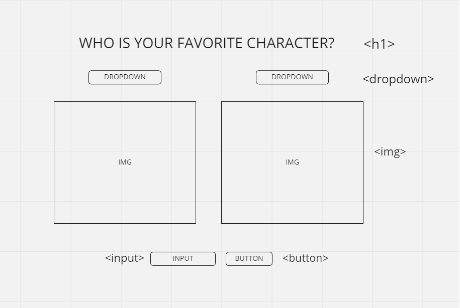

)

# HTML

-Header
Why? To display the title of the page to the user
How? <h1></h1>
-3 Drop down selectors
Why? To give the user the option to select different options
How? `selectEl.value`
-3 image selections
Why? To give the user visual options of what they selected
How? `imgEl.src = someImgURL`
-Input
Why? To give the user the option to make comments
How? `inputEl.value`
-Button
Why? To give the user access to submit their input/comment
How? buttonEl.addEventListener('click', () => {});
-Div for comments
Why? To display their comments
How? functions displayComments {}

# STATE

-Character options
-List of comments
